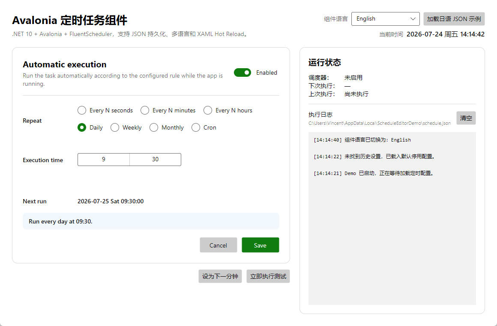

# ScheduleEditor

[简体中文](README.zh-CN.md) | [English](README.en-US.md)

`ScheduleEditor` is a reusable Avalonia component for visually configuring and running in-process scheduled tasks.

`ScheduleEditor` 是一个用于可视化配置并在应用进程内执行定时任务的 Avalonia 组件。



## Install / 安装

```bash
dotnet add package ScheduleEditor --version 1.0.0
```

```xml
<PackageReference Include="ScheduleEditor" Version="1.0.0" />
```

## Highlights / 主要功能

- .NET 10 and Avalonia 12.1
- Every N seconds, minutes, or hours
- Daily, weekly, monthly, and custom Cron schedules
- JSON persistence with automatic restoration on startup
- Built-in Simplified Chinese and English
- External JSON language packs, host-side loading examples, and partial text overrides
- Per-mode visibility switches; daily, weekly, and monthly are shown by default
- FluentScheduler runtime integration and task overlap protection
- Debug Hot Reload through HotAvalonia

For installation, application-A integration, external language-pack loading, localization persistence, Hot Reload, and troubleshooting instructions, open the language-specific README above.

## Package metadata

- Package ID: `ScheduleEditor`
- Authors: `vincent, chatgpt`
- Repository: `https://github.com/hupo376787/ScheduleEditor`
